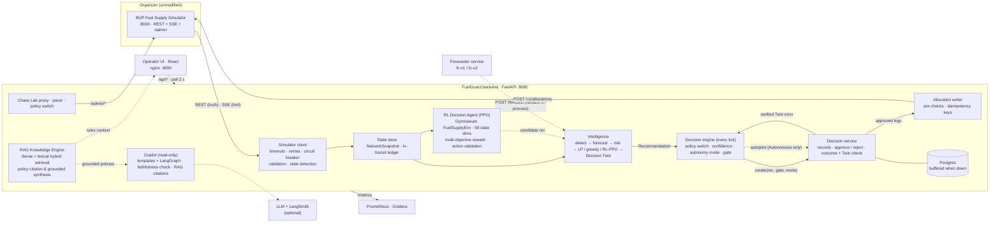
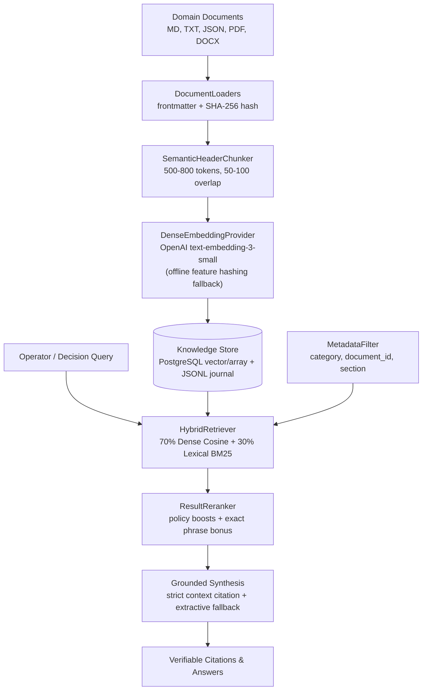
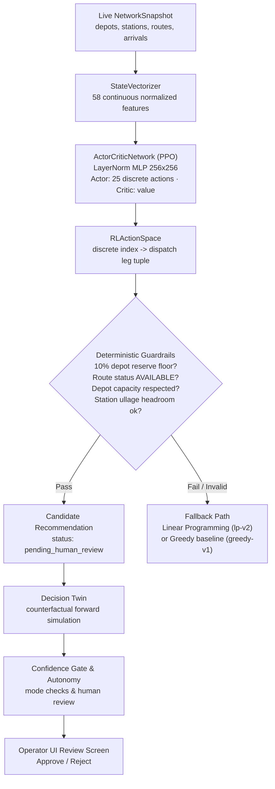

# Architecture

FuelGuard is a decision-support layer on top of the organizer's **BUP Fuel Supply Simulator**. The simulator is the
only source of truth and the only thing that changes the (simulated) world. FuelGuard reads it, predicts, recommends,
asks a human when it should, posts approved allocations back through `POST /v1/allocations`, and afterwards checks
its own projections against what the simulator actually did.

> Simulated environment only. No real fuel infrastructure, purchases or dispatches.

## Components and owners

| Component | Where | Owner | If it fails |
|---|---|---|---|
| Simulator client, breaker | `backend/app/sim/` | Anadi | Cached snapshot marked stale; writes held |
| State store | `backend/app/state/` | Anadi | Last good snapshot with its age |
| API, operator key, Chaos Lab proxy, pacer, policy switch | `backend/app/api/`, `backend/app/ops/` | Anadi | — |
| Decision service, Postgres repo, outcome + Twin check | `backend/app/decisions/service.py`, `backend/app/db/` | Anadi | Records buffer in memory + JSONL |
| Forecaster | `forecaster/` | Turjo | In-process profile predictor; confidence drops |
| Detection, risk, LP, greedy, Decision Twin | `backend/app/intel/` | Turjo | Greedy policy; no Twin → no futures shown |
| **RL Decision Agent (PPO)** | `backend/app/rl/`, `rl/` | Turjo | Fallback to LP optimizer (`lp-v2`) or Greedy (`greedy-v1`) |
| **Decision engine, confidence gate, autonomy, autopilot** | `backend/app/decisions/engine.py`, `gate.py`, `routes.py` | Samprity | Engine shown as down; nothing is recommended or executed |
| **Copilot** | `backend/app/explain/` | Samprity | Deterministic template explanation |
| **RAG Knowledge Base** | `backend/app/rag/`, `rag_data/` | Turjo | Extractive grounded synthesis; memory + JSONL buffer |
| **Operator UI** | `frontend/` | Samprity | Last snapshot + "backend unreachable" banner |
| Metrics, logs, dashboards | `backend/app/obs/`, `monitoring/` | Anadi | — |

## One decision, end to end

1. **Observe.** The state store refreshes the `NetworkSnapshot` every tick (REST is truth; SSE only triggers a refresh).
2. **Recommend.** The decision engine runs in the backend once per new tick, whether or not anyone has the UI open.
   It calls the intelligence service: detection signals, forecasts, risk (time to stockout, P(stockout)), an LP plan
   and a greedy plan, and three Twin futures (do nothing / greedy / LP), each future carrying its own legs.
3. **Apply the policy switch.** Each Twin future becomes a candidate; the backend's active policy (`PUT /api/policy`,
   `greedy-v1` by default, rollback to the last accepted one) selects which one is recommended.
4. **Score confidence.** `decisions/gate.py` computes confidence from six live factors: forecast fit, Twin accuracy
   (from verified decisions: projected vs actual unmet), data freshness, demand normality, component health and
   no active crisis. Weights 0.25 / 0.20 / 0.20 / 0.15 / 0.10 / 0.10.
5. **Set the mode.** Autonomous (≥ 0.80, fresh, healthy, no crisis) / Supervised / Manual (< 0.60 or stale).
   Drops are immediate; climbing takes 3 healthy ticks per level; Autonomous needs an operator to re-arm.
6. **Gate.** Guardrails hold in every mode: no DISRUPTED route, no OUTAGE station, no depot below a 10 % reserve.
   A human must approve when the mode is Manual, confidence < 0.80, the plan is containment, a leg is above
   5,000 L, the total is above 6,000 L in Supervised, or a guardrail blocked a leg. Stale data makes a
   recommendation recommend-only.
7. **Record.** A recommendation with shipments becomes a `DecisionRecord` through `DecisionService.create()` with
   its gate and mode (stage `gated`), persisted to Postgres.
8. **Review or autopilot.** The operator approves as is, modifies litres, or rejects with a reason
   (`X-Operator-Key`). In Autonomous mode, a decision the gate clears is approved as `autopilot` through the same
   path.
9. **Submit.** The allocation writer splits legs to `max_shipment`, pre-checks tank headroom including fuel in
   transit and disruptions at departure, and posts with deterministic idempotency keys `fg-{decision}-{leg}`.
10. **Verify.** When the Twin horizon ends, the decision service reads actual unmet demand from the simulator and
    stores `twin_check = {predicted_l, actual_l, error_l}` (stage `verified`). That error feeds the Twin-accuracy
    factor, so a Twin that starts missing lowers confidence.
11. **Explain.** The copilot explains any decision, answers questions about a station, summarizes the network and
    writes incident reports, always from structured facts. An LLM answer containing a number that is not in the
    facts, or the word "saved", is discarded and the template is shown.

## Operator UI

The UI is built around the story a judge or operator needs, not around every field the backend has:
what is happening → what is at risk → what the system recommends → why → what happens if I act.
All pages share one 2-second poll of cached backend state (the UI never calls the simulator).

- **Overview**: four numbers (service level, stations at risk, active events, system mode), the live network map with
  each station's status, and a short "Needs attention" list. When nothing is wrong it says so.
- **Intelligence** (the hero page): the current recommendation as five steps, each showing input → finding → output.
  Detect (recent demand vs its normal band, detector signals), Predict (time to stockout, probability, projected
  inventory), Decide (recommended action, evidence, constraint checks, copilot explanation), Simulate (Decision Twin:
  without action vs with the recommendation), Approve (approve / modify / reject through the confidence gate). The
  confidence pill opens the six factors, the autonomy state machine, and re-arm / manual controls.
- **Simulation Lab**: run a demand spike, station outage, route disruption or stream failure (and every other event,
  fault and forecaster failure under "More scenarios"). The lab advances a paused simulator itself and shows a live
  chain: injected → active → detected → predicted → allocation generated → waiting for review, each step checked
  against real state. Simulator controls, policy switch / rollback, timeline and the incident report live here.
  Locked behind the operator key.
- **System Health**: one headline, the components with their fallbacks, API p95 / error rate / last sync, and recent
  activity; deployment, freshness and copilot / tracing details on demand.
- **Architecture**: this pipeline as a diagram, and what happens when each part fails.
- Drill-downs: a station (stock, routes, demand chart, ask the copilot), network details, and decision history with
  a stage-by-stage replay.

## Retrieval-Augmented Generation (RAG) Subsystem Architecture

The RAG subsystem (`backend/app/rag/`) bridges operational execution with domain governance, safety rules, and historical evidence.

- **Data Ingestion (`backend/app/rag/ingestion/`)**: Multi-format loader with change detection via SHA-256 checksums, semantic section chunking, and dense embedding.
- **Hybrid Retrieval (`backend/app/rag/retrieval/`)**: Combines cosine similarity over dense vector spaces with lexical keyword matching, filtered by metadata and reranked using domain-specific policy boosts.
- **Storage & Resiliency**: Dual-mode persistence in PostgreSQL (with vector/float array indexing) and transactional disk journaling (`/tmp/fuelguard-rag-store.jsonl`) for zero-dependency offline failover.

## Reinforcement Learning (RL) Decision Subsystem Architecture

FuelGuard's RL subsystem (`backend/app/rl/`) applies Deep Reinforcement Learning to learn complex multi-depot, multi-station dispatch policies while guaranteeing safety boundaries.

- **Environment (`FuelSupplyEnv`)**: Gymnasium wrapper over network snapshots supporting multi-objective reward formulation:
  $$R_t = 2.0 \cdot \text{ServedLiters} - 5.0 \cdot \text{UnmetLiters} - 0.05 \cdot \text{TransportCost} - 10.0 \cdot \mathbb{I}_{\text{reserve\_viol}} - 20.0 \cdot \mathbb{I}_{\text{invalid\_action}}$$
- **Safety Guarantee**: The RL agent is strictly isolated from directly dispatching fuel. Proposed actions pass deterministic guardrails (`validate_action`), generate candidates for the Decision Twin, and require operator approval or confidence gate verification.
- **Automated Fallback**: Any safety violation, model degradation, or stale state locks out autonomous RL and transparently redirects to LP (`lp-v2`) or Greedy (`greedy-v1`).

Failure states are explicit: a sticky "Simulated environment" strip on every screen; red banner when the backend is
unreachable (last snapshot with its age, approvals paused) or data is stale (recommend only); amber when the simulator
circuit is open; "Mock data" when no backend was reached.

See the [README](../README.md) for the full API table and [backend-integration.md](backend-integration.md) for the
contracts between lanes.
